# Compass Maritime Services LLC: Valuing Ships
Predicted the price of a ship with 95 % accuracy based on several KPIs and market approach valuation method.
- Skills & Tools: R, Tableau, Linear regression, KNN regression, Hypothesis Testing and, Predictive Modeling

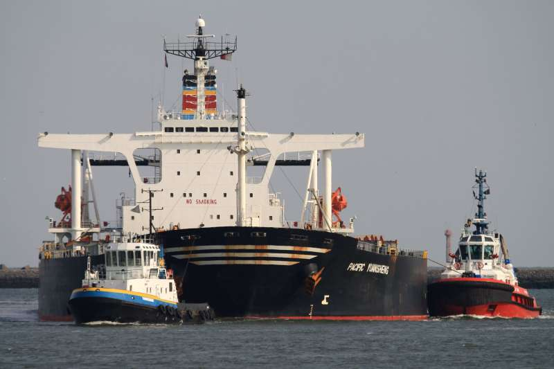

### Executive Summary
Compass Maritime Services offers consulting services for clients who are interested in purchasing and selling maritime ships and offshore vessels. Basil Karatzas, director for projects and finance will help the client who is interested in purchasing a ship named BetPerformer, to determine the valuation and negotiation strategy of the ship. This report will show methodology, valuation analysis, concerns, best value and also suggest the bid price for the ship. The value accounts for all variables provided and gives the client the best chance to secure Bet Performer for its current market value.

#### Bet Performer
Bet Performer is a bulk carrier with 172000 DWT and 12479 Capesize index. The ship is 11 years old and was built in Japan in 1997. This ship has a MAN-B&W engine with an engine power of 14710 KW and has nine holds and hatches. The same ship was sold two years back under a different name Mineral Poterne for $70 million.

#### Valuation Approach
Ships are valued using three different approaches. The first one is the market approach which is the most popular one. As we are valuing our ships using the market approach, we compare the price and other variables with those of other ships that were sold recently in the market. This approach is also called the ‘mark-to-market’ approach. The second approach called income approach which uses the forecast of future cash flows such as daily charter rates to estimate the net present value of the ship. This is also called a ‘mark-to-model’ approach. This approach would most likely produce a rationally deducted price that reflects the value of the vessel. The final approach is known as cost approach where vessels are valued on the assumption that how much it will cost to build the ship from base today in the original conditions and retrofit to our present conditions. This is a less popular approach.   

#### Variables
Data consists of recent Sale Date, Vessel Name, Price, Sale Year, Year Built, DWT and Capesize. The weight of these ships is measured in deadweight tons and is the sum of cargo, fuel, fresh water, passengers and crew weights. DWT for Capesize is greater than 100000. The baltic dry index calculates multiple shipping costs for different raw materials among various routes.Year built and Age at Sale represents the same factor. Age at Sale is the best predictor of the price when compared to other variables owing to the highest correlation. DWT and Capesize also has a significant correlation with the price of the ship and can affect the price. Sale Date has the least correlation and lowest influence on the price.  In addition to the data collected about similar ships factors such as main engine type, repairs, building company reputation, charter contracts with counter-parties, loading equipment, shipyard and location of the ship at the time sale also influence the price of the ship. The following correlation table shows the relationship between price and the other variables.
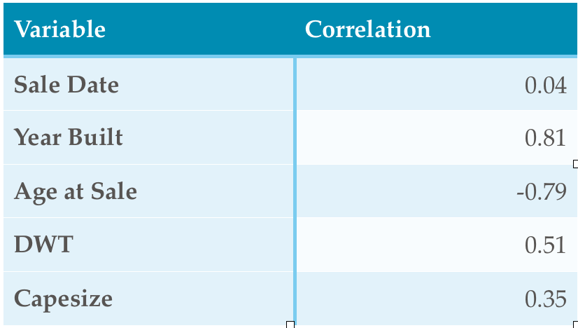

## METHODS
In order to come up with the best reference transaction and find the closest ship with respect to features compared with those of Bet Performer, the following approaches were used.
- Rank Ships
- KNN Regression

### Rank Ship
The whole dataset of 48 other ships with all the features was considered. The objective was to find the transaction of a ship which was the closest to Bet Performer based on features like Age at Sale, DWT, Capesize, Sale Date, Year Built etc. Initial data analysis indicated that the Sale Date had a minimal correlation with the price of the ship. Year Built was directly correlated to Age at Sale, thus can be omitted for the analysis as it conveys the same meaning. Thus as part of data preprocessing the Year Built and Sale date were omitted from being considered for analysis. It led to DWT, Age at Sale and Capsize to be the major independent variables to predict the closest ship. The following steps were performed for each of the features i.e DWT, Capesize and Age at Sale.
- Each feature was compared to the respective feature of Bet Performer and the difference was calculated.
- The difference calculated for each feature was normalized to a range of 0 to 1.
- The normalized difference was multiplied with the correlation between each feature and the price of the ship in order to give more weight to features that were strongly correlated.
- The weighted difference for all the features was added together to derive the net weighted difference.
- All the ships were sorted based on the net difference and the ships with the lowest net difference were labeled as the closest with respect to the feature of Bet Performer.  

#### Inference
By this analysis, we found out that Sumihou and CapeSun were the best reference transactions and closest comparable ships to Bet Performer.
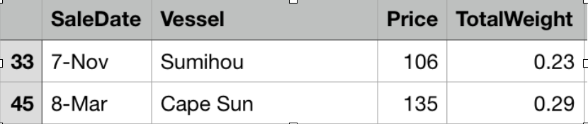

### KNN Regression
In pattern recognition, the k-nearest neighbor's algorithm (K-NN) is a non-parametric method. The input consists of the k closest training examples in the feature space and the output is the property value for the object. This value is the average of the values of k nearest neighbors.

In order to test the KNN Regression model for the dataset, 70% of the data was set aside to train the model. The left over 30 % of the data was used to test the model.  DWT, Age at Sale and Capesize are used as the predictors and price as the response.

The scatter plot was plotted for the predicted price against the actual price of the ships in the test data set. For a perfectly predicted value, we would expect to see points along the y=x line.
As most of the points followed the y=x line, we can conclude that KNN can be used as one of the approaches to predict the price for Bet Performer and went ahead to test the model with Bet Performers features i.e Age at Sale, Capesize and DWT.
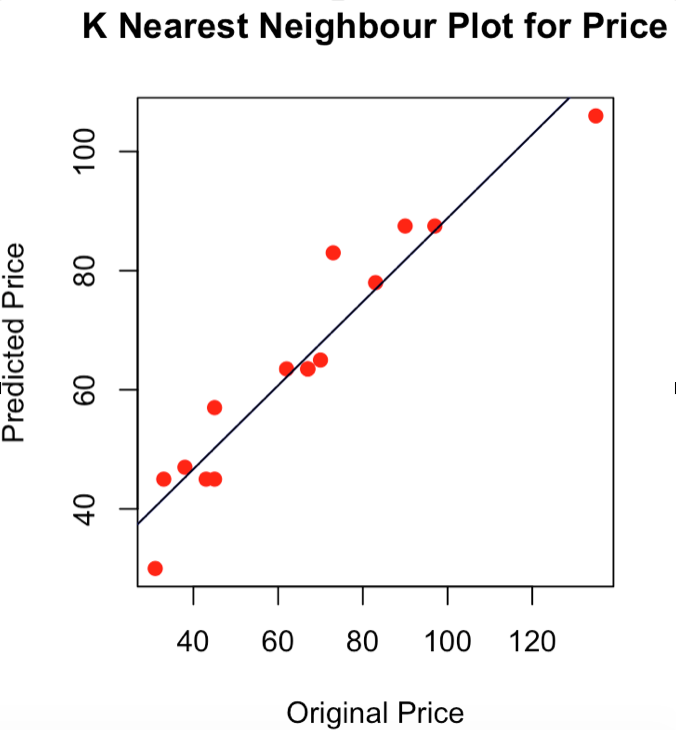

#### K Value Selection 
Root mean square error is a quadratic scoring rule that measures the average magnitude of the error. It’s the square root of the average of squared differences between prediction and actual observations. Since the errors are squared before they are averaged, it gives a relatively high weight to large errors. The method is more useful when a large error is particularly undesirable. The model with the lowest values is a better fitting model i.e K=5
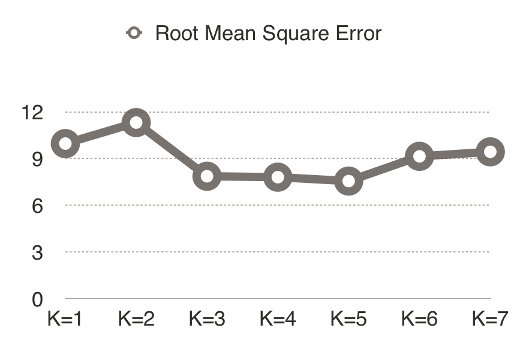

#### Inference 
As the purpose was to get the closest ship, Sumihou emerged out to be the closest neighbor [K=1] with predicted price as $105M. As per the KNN Regression model, the price predicted for Bet Performer for the optimum value of K ie K=5 is $81.94M.

#### Limitations
The data set was quite scattered where there were lots of data points for ships for which the price was less than $100 M. The practical limitations of the algorithm is it just considers the small number of the sample from a dataset for feature matching and prediction. In the above scenario, the algorithm considers just the 5 closest ships to predict the price of BetPerformer. There are lot of observations and outliers which are not considered, thus it's not the best approach to predict the price. It can be used as one of the methods to find the best reference transaction or the closest ship with respect to features compared with those of Bet Performer
 
In order to predict the price of Bet Performer ,couple of approaches were considered.
- Simple Linear Regression
- Multiple  Linear Regression

### Simple Linear Regression
Simple linear regression lives up to its name, it is a very straightforward approach for predicting a quantitative response Y on the basis of a single predictor variable X. It assumes that there is approximately a linear relationship between X and Y. Mathematically, we can write this linear relationship as Y ≈ β0 + β1X. We computed a simple linear regression model on Age at Sale, Capesize and DWT (independent variables which are highly correlated to price) individually to predict the price of the Bet Performer as shown in the table below.

By analyzing the price of the ships against independent variable ie Age at Sale, DWT and Capesize we found out that:
- Age at Sale : Ships value depreciates at a rate of around $4.2 million with every year as it ages.
- DWT : For every one unit increase in DWT, the price of the ship increases by $0.98 million.
- CapeSize : For every one unit increase in CapeSize, the price of the ship increases by $0.004 million.
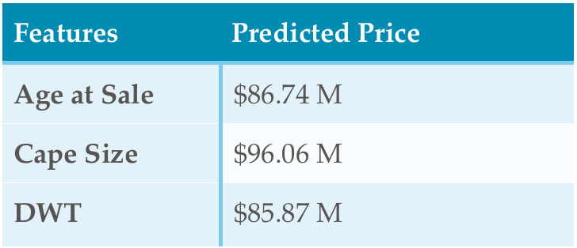
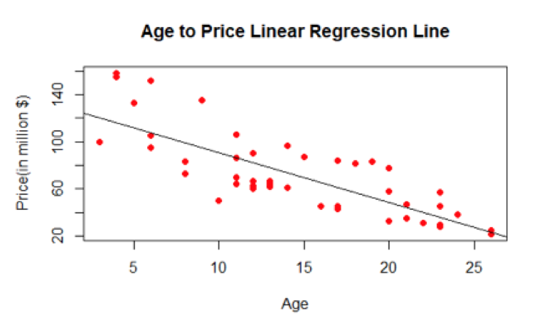
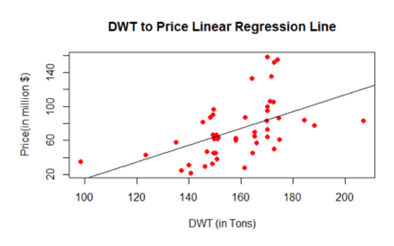

### Multiple Linear Regression 
Simple linear regression is a good approach for predicting the dependent variable on the basis of a single predictor variable. In our case, we have examined the relationship between Price (dependent variable) and Age at Sale, Deadweight tonnage (DWT) and Capesize individually (independent variables). We ran three separate simple linear regressions, each of which uses a different independent variable as a predictor as shown in the results above. 

However, this approach of fitting a separate simple linear regression model for each predictor is not entirely satisfactory. First of all, it is unclear how to make a single prediction of Price given levels of the three variables Age at Sale, Deadweight tonnage (DWT) and Capesize Index, since each of the variables is associated with a separate regression equation. Second, each of the three regression equations ignores the other two variables in forming estimates for the regression coefficients. If these independent variables are correlated with each other in the ship data, then this can lead to very misleading estimates of the individual effects on Price. Instead of fitting a separate simple linear regression model for each predictor, a better approach is to directly accommodate multiple predictors. We can do this by giving each predictor a separate slope coefficient in a single model. We can go for 4 different predictor combinations for our Multiple Regression model.

The combinations are listed below.
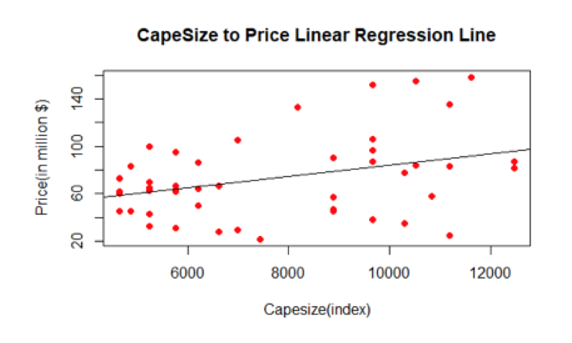

The RSE estimate gives a measure of the error of prediction. The lower the RSE, the more accurate the model (on the data in hand). Adjusted R^2 estimates the % of the variation in the measure of the sale price of the ships that can be predicted by independent variables. Based on the Adjusted R Square and Residual Standard Error the combination of age at sale, DWT and Capesize combination emerge out as the best model for multiple linear regression to predict the price of Bet Performer. This resulted in a model where 91.5% of the variation in the sale price of ships could be explained by Age, DWT, and Capesize.
We went ahead and used this model to predict the price of the Bet Performer. The predicted price as per multiple linear regression came out to be $125.83 M.
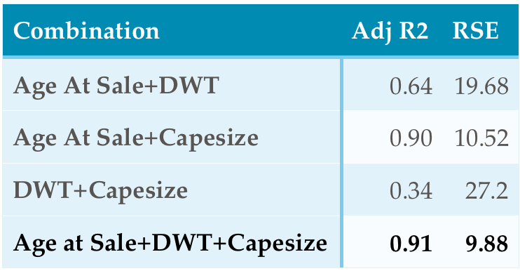
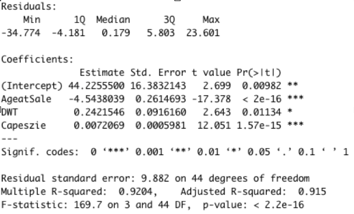

##### Predicted price of Bet Performer under various scenarios
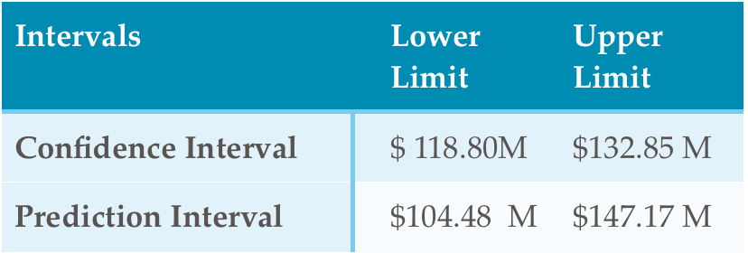

### Further Analysis
Analyzing the whole dataset, there are certain observations to be noticed. We plotted the histogram for the original price for all the 48 ships which were studied.
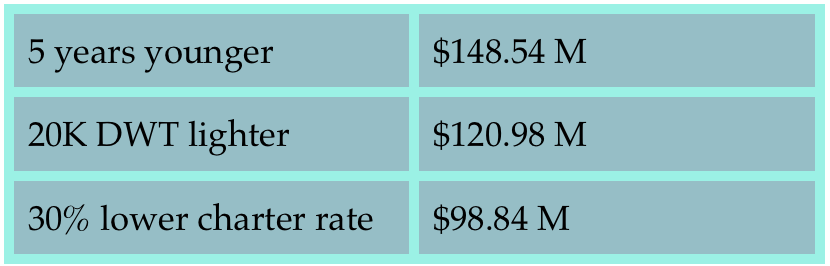

By observing the plot it was evident that only a few ships were there in the dataset for which the original sale price was in the range of the prediction interval of BetPerformer i.e between $104 M and $147 M.We anticipated that the prediction in this interval would not be accurate as most of the data points fall under  the price less than $100 M . We further went ahead and trained the model with 70% of data and tested the model with 30% of data. The following plot emerged out which showed the high confidence interval for the region.
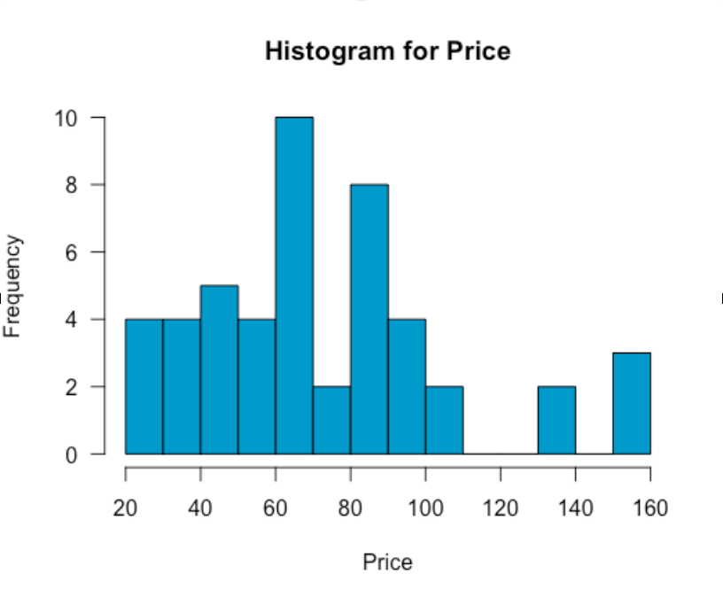

The dataset was segregated into two buckets, one has a price less than $100 M and the other having price greater than $100 M. For the first set of ships having majority of ships (85%), the average of prediction error was 0.8 (Negative) which signifies that the model worked accurately for the 85 % of the ships and the predicted price was overpriced just by 0.8 M. The results were startling for the other set of ships which accounts for 15 % of dataset . The predicted price deviated a lot from the original price. This accounts because there are very few ships having a price greater than $ 100M. The ships were underpriced by $6.36 M at an average.The above inference was considered to adjust the underpriced prediction. The final price predicted for Bet Performer as per our case study will be **$ 132.19 M**.

### Conclusion
The purpose of analysis was to come up with the predicted price of Bet Performer which would fall under both the client and the seller's satisfaction. We did a detailed study using the Market Approach as the base and came to a final price of $ 132.19M for the Bet Performer which we think will be the amount to bid and successfully buy the bulk carrier ship which the client had interest in.
