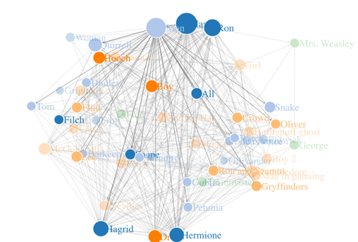

# HARRY POTTER AND THE SORCERER’S STONE - MOVIE ANALYSIS

## Background
What makes HARRY POTTER AND THE SORCERER’S STONE so uniquely successful?
- Made $32.3 million on its opening day, breaking the single day record
- The film earned $974.8 million at the worldwide box office
- The second highest-grossing film in history at the time, The year's highest-grossing film

## METHODOLOGY
- Pre-processing
- Frequency Analysis
- Topic Analysis
- Social Network Analysis
- Sentiment Analysis

  - # Pre-processing
  The data was web scraped from **hogwartsishere** [website](https://www.hogwartsishere.com/library/book/7391/chapter/1/).
  After cleaning and preprocessing the data , it was store in an excel file with details about the
    - SpeakerSpeaker
    - Dialogue 
    - Recipient 
    - Scene
      
     

  - # Frequency Analysis
  Most frequent words were 
    - Hardship
    - Family
    - First Experiences
    - Mysticism/Magic
  

    
     
  

  

  - # Topic Analysis
  
  
  - # [Social Network Analysis](https://rpubs.com/nishant12th/553693)
 
 A set of relational method to understand and identify the connections among the nodes, characters and entities .

## Network Components: 
- Nodes : Characters , Entity , Organization etc. 
- Edges : Relation 

## Measuring Networks
Answers which nodes are at the center of the network.

- **Degree** :  Number of links held by each node

- **Closeness**: Scores each node based on their ‘closeness’ to all other nodes within the network.

- **Betweenness**: Measures the number of times a node lies on the shortest path between other nodes.

  
- # Sentiment Analysis
 ### Harry Potter
  - Turbulent Character with a large range
  - Highest around scene 35 (Troll Scene)
  - Lowest in two points
   
    

 ### Hermione
  - Lowest is around scene 35 (Capture By Troll) 
  - Highest is around scene 56 (her realization of the sorcerer's stone) 
   
    

 ### Ron
  - Highest when saving Hermione
  - Relatively consistent with story progression when compared with other characters
   
    

 ### All the scenes
  - Story progression towards a climax and overcomes it
   
    

 ### All characters
  - Relationships at lows and highs
  - They help each other when they need help most
  - Their personalities complement with each other which make them a great team
   
    

## Character Time Series
 
 
 ## Results /Insights
 
 ### Take  people into Harry’s World
 - Further developed the marketing strategy
- Images from movie were released sparingly before it hit theaters
- Actors’ images became synonymous with the Potter Brand

### Genre
- The three genres Harry Potter falls
- Exponential  Growth
- Slopes are almost unmatched

### 2001: A Year of Hardships 

## Conclusion
What makes HARRY POTTER AND THE SORCERER’S STONE
 so uniquely successful?

**"It is the right movie appears in the right time, right place"**

## Limitations
- Negative and Positive Connotation for Words
- Outside Data Available
- Accuracy with Preprocessing Algorithm
