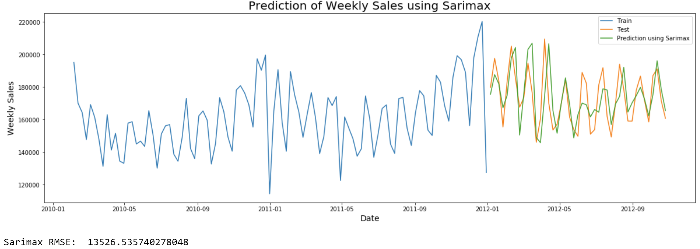
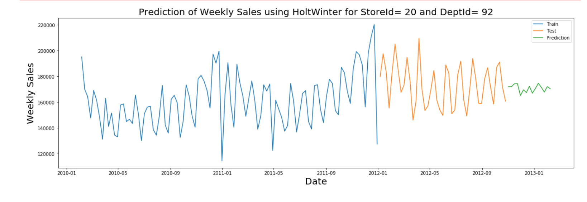

# DSCI 521: Data Analysis and Interpretation   Term Project : Walmart Sales Forecasting

### Team Members
- Group member 1
    - Name: Padma Priya Jayaraj
    - Email: pj349@drexel.edu
- Group member 2
    - Name: Soumya Sinha
    - Email: ss4947@drexel.edu
- Group member 3
    - Name: Himani Hasani
    - Email: hh579@drexel.edu
- Group member 4
    - Name: Nishant Anand
    - Email: na826@drexel.edu

### Project Group Members 
- Group member 1
    - Name: Soumya Sinha
    - Intro:Areas that the team member has control and knowledge of is business analytics with 3 years of experience having worked for retail and search advertising companies. I have hands on experience in R, Python, SQL and visualization tools like Tableau. More inclined to explore and analyse the retail domain utilising python as the major tool for visualization and data interpretation. Excited to enhance analytical skills through this course.

    
- Group member 2
    - Name: Nishant Anand
    - Inro: Undergrad in Computer Science with 4 year of work experience as a Software developer.My work experience and coursework have made me fluent in several programming languages and tools like Java,R,SQL,RestAPI. I am excited to learn more about interpreting the data and its potenetial application. 

    
- Group member 3
    - Name: Padma Priya Jayaraj 
    - Intro: I am passionate about data, I would love to explore, analyze any data and perform model building. Interested in predicting, forecating and classification techniques. I have learnt to use Python, R for building statistical models and analyzing data in the previous quarters. In future I would like to become a data scientist and practise Python, R, SQL, Excel skills which I am really fond of. I am more interested in Retail and Healthcare industry.

- Group member 4
    - Name: Himani Hasani
    - Intro:  - My interest in data analytics developed during my undergrad education. Since then, I have gained a good knowledge in databases like  MySQL, MS SQL Server, PostgreSQL and Oracle. Apart from that I have interest in data Visualization. I intent to develop my programming skills and stronger analytical skills during the duration of this course.

## Motivation

After a thorough discussion about the background and skillsets, all the member of the team wanted to work on a retail dataset to build models which we have not tried before. Again Time Series Forecasting was intriguing for all. Motivated by the domain and the interest, we selected Walmart's historical data of 45 Stores across the region to build a Time Series Forecasting model to predict the department wise sales for each of the stores.
Since the motivation is not limited to Univariate TimeSeries Forecasting models, we would also be exploring several other factors like Temperature, Fuel Price, Consumer Price Index, Unemployment, etc which affects the sales and supply chain in the retail sector.

As we work on the dataset, we are curious to know how external factors like Fuel Price or the temperature affects the sales for any retail industry. There would be a lot of other external factors and it would be interesting to understand the rank and importance of these factors. Moreover, we would be applying multiple models to choose the best one based on the RMSE score of each model.

###  Who would  be interested in our analysis?

It would be beneficial for the head of the supply chain department division of Walmart to see the results of the analysis. The inventory in-stock and out-stock issue would be resolved once the department wise sales forecast is done. Due to different fluctuations in price in Markdown events, it is difficult to predict how many in-stock items are required in the inventory. Also, it might be beneficial for a few outside manufacturers or sellers who would be able to complete the demands sooner.

### Application

This analysis could be used in any of the forecasting demand problems associated with price/items and can be applied directly in forecasting models (minor tweaks based on seasonality or markdown events). If accurately predicted, Walmart can use this analysis to store products according to the requirement at various times. This dataset can also be used to estimate the economic situation in the store region as it provides details about services like fuel price, consumer price index, and unemployment rate in the region.Another main advantage of forecasting would be to understand the number of employees required in the future to meet the production level.

## Data
The dataset is a historical dataset provided by Walmart for a competition on [Kaggle](https://www.kaggle.com/c/walmart-recruiting-store-sales-forecasting/data) .The timeseries data ranges from Feb,2010 to November 2012. The analysis would be on a weekly basis as the dataset provides sales information for every week in the mentioned timeframe.
Following information is provided in the dataset.

- **Store**:The store number
- **Dept**:The department number
- **Date**:The week of the year
- **Weekly_Sales**:Sales for the given department in the given store
- **IsHoliday**:Whether the week is a special holiday week
- **Temperature**:Average temperature in the region
- **Fuel_Price**:Cost of fuel in the region
- **MarkDown1-5**:Anonymized data related to promotional markdowns that Walmart is running. MarkDown data is only available after Nov 2011, and is not available for all stores all the time. Any missing value is marked with an NA.
- **CPI**:The consumer price index
- **Unemployment**:The unemployment rate
- **IsHoliday**:Whether the week is a special holiday week
- **Type**:Type of the store
- **Size**:Size of the store

## Exploratory Data Analysis

Reading the different files for our analysis.

**feature.csv** - Date level store information with additional columns like temperature, fuel price, CPI, Unemployment, markdown price that affect the store sales. 
_No sales data in this file_

**stores.csv** - Store information with size and type of store as either A, B or C. 

**train.csv** - Department store level weekly sales data. 

**New Merged_walmart.csv** - Merging files to get the store dept date level sales with external factors affecting sales 

#### Missing Data

All the cloumns have no missing data apart from the Markdown columns. All Markdown columns have more than 60% missing data. Each of them have been listed below:
- MarkDown1 = 64% missing data
- Markdown2 = 70% missing data
- Markdown3 = 67% missing data
- Markdown4 = 68% missing data
- Markdown5 = 64% missing data 

There is no data available for Markdown columns before November 2011. This is because, before 2011 Walmart was reluctant to share its data but to understand customers better, they agreed to share scan data with external research firms to analyze customer behavior. 
[source](https://retailwire.com/discussion/walmart-to-share-scan-data/#:~:text=Walmart%20says%20it%20wants%20to%20better%20understand%20its%20customers.&text=Since%20Walmart%20first%20made%20the,to%20fully%20understanding%20the%20market)

#### Exploring the Data Types of all the variables

The dataset represents sales data from 45 stores and 99 departments in them. Average weekly sales across all stores is 15981. The average temperature varies from store to store varying from -2 Fahrenheit to 100 Fahrenheit. This shows that the stores chosen belong to different regions in the United States as states in North have lower temperatures as compared to temperature in states in the South-West. The variation of fuel price shows that the fuel prices have gone high over the years due to changing economic conditions. But the variation in fuel price is not too high. The Markdown columns have the most amount of missing data. The CPI has changed from a minimum of 126 to a maximum of 227 in the given dataset. This explains that there has been constant growth in the price of consumer goods. The unemployment rate is provided for different stores. The average unemployment is high in the selected stores with a maximum of 14 in some store. The size of stores varies largely. This is can be seen by the the large value of standard deviation in the size column. The size of the store depends on where it is located. Thus a larger store might be seen in an area with higher population but areas with low population might not require it.

#### Final Dataset

#### Sample Time Series data for Store id =1 and Department id=1

#### Correlation 

Following correlation matrix is for Store=1 and Dept=1, in this:

- Unemployemnt and CPI are very highly negatively correlated which means as Unemployment increases, CPI decreases
- Year and Unemployment are highly negatively correlated, according to census more people are educated as each year passes
- CPI and Fuel Price are positively correlated because fuel is the main source for automobile transportation, so if the fuel price increases, the end products costs also increase
- Day and Markdown1 are highly correleated,meaning some promotional offers are related to specific days of the month.

#### Boxplot for sizes of types of stores

Below boxplot shows that Store Type A is the largest and store type C is the smallest in terms of Size. So it might be interesting to observe the weekly sales comparsion between these stores given that A is the largest store.

From the below box plot, Type A makes more sales when compared to B and C. The larger store makes more sales.

Weekly Sales is more when the temperature is 30-80 and its relatively low when the temperature is too low as well as when it is too high

December and November makes more weekly sales when compared to other months due to major holiday seasons like Thanksgiving and Christmas

#### Stores with highest Unemployment 
The umemployment rate is higher in areas of stores 31, 30, 25, 21, 20 and 2. A reason for higher unemployment in these areas could be beacuse of the jobs people lost around The Great Recession of 2008.

#### CPI across all the Stores

A high CPI across all stores is observed. This indicates inflation in prices of goods and services across various stores.

Stores 22 and 35 have a comparatively low CPI, thus the price of goods in these stores might be less as compared to others. This might a reason to attract more consumers to these stores. Another reason could be that these stores are located in remote locations, therefore their sell might below. Also, the goods in these stores might be outdated resulting in lower prices of goods in these stores.

#### Portion of timeframe with holidays in the week
A pie chart representing Holiday vs non Holiday timeframe has been plotted for all the weeks present in the dataset. This trend would be same across all the 45 stores

#### Store weekly sales

Below bar graph shows weekly sales of every store. Store 20 has the highest weekly sales and store 5 the least weekly sales.

#### Department wise weekly sales

All the 45 stores have around 99 departments, so below bar graph shows the weekly sales in every department. Department 92 and 95 have very high weekly sales and it would be interesting to note the similar trend for other stores too.

We now create DF for all the time series seperately for every store dept combination. Around 3331 time series are generated.

## Time series Models

### Various Time Series Models
We have performing below models for building our Time Series forecast.
Our focus would be to select a model that works best with weekly time series data.

- Autoregressive Integrated Moving Average(ARIMA)
- Holt Winter’s Exponential Smoothing(HWES)
- Seasonal Autoregressive Integrated Moving-Average with Exogenous Regressors(SARIMAX)

We have depicted univariate analysis in our analysis for now. In univariate analysis, the output variable(sales) is influenced by only one factor whereas in multivariate it is influenced by many factors.

### Uni-Variate Time Series Model

Univariate data deals with a single variable. It has decriptive properties identfied by some estimates like central tendency (mean, mode, median), dispersion (range, variance, maximum, minimum, quartile and standard deviation) and the frequency distributions, bar chart, histogram, pie chart, line graph, box and whisker plot. 

#### Autoregressive Integrated Moving Average Model (ARIMA):

ARIMA model is a class of statistical models and it is used for analyzing and forecasting time series data.
It specifically caters to a suite of standard structures in time series data and it provides methods to make better forecasts. 
When checked for data whether it is stationary or not. We performed Dicky Fuller Test to check the data. The data was non- stationary as the p-Value was greater than 0.05. So, we performed Differencing and shifting to make it stationary and also observed few seasonal patterns in our data.
The notation used is ARIMA(p,d,q) where the parameters are replaced with higher integer values for which the corresponding AIC value is low when compared to the overall computation. By using Auto Arima model we get the p,d,q values based on lower AIC and BIC values.
The parameters of the ARIMA model p represents the number of lag observations included in the model, also called the lag order. d represents the number of times that the raw observations are differenced, also called the degree of differencing and q represents the size of the moving average window, also called the order of moving average.
From the ARIMA model graph, we see that the prediction and test results have few variations though initially it was predicting the same as test results. 

Root Mean Square Error (RMSE) is used in measuring forecast accuracy. So, the model which gets least RMSE value will be the best model to forecast for future dates.

#### Holt Winters Time Series:

Holt winters is also one of the time series model and widely known as Triple Exponential Smoothening algorithm. As, it mainly considers three important factors for forecasting.

1.	A typical value (average)
2.	A slope (trend) over time
3.	A cyclical repeating pattern (seasonality)

We have used holt winters exponential smoothening on data, so most of the values in the train data are encoded, inorder to provide better test and forecast results. From the graph, we come to know that it has almost correctly fitted the test values.

RMSE value is lower than Auto Arima.

#### Seasonal AutoRegressive Integrated Moving Average with eXogenous regressors (SARIMAX):

In the previous models we have been using only the past historical data. It is an extension of ARIMA and SARIMA, where in SARIMA two more parameters (Seasonal = True and m = the seasonality value) were added when compared to ARIMA. But in this model, it takes care of the external features too which influence a time series, just by adding “Weekly_Sales” feature to assist the model and make better predictions. Though the addition of an extra feature, takes little longer time to predict when compared with other models, it gives reduced RMSE value.

In the below plot, the test and the prediction using SARIMAX is almost the same. The RMSE value obtained is less when compared to the other two models. So we went ahead, in forecasting the future weekly sales for future dates using SARIMAX model.

### Time Series Forecasting at Store and Department Level

A very efficient univariate function has been created which selects best model out of the three time series mentioned earlier and returns the forecast sales for a any store and department number that is taken as an input!

We depict the forecasted weekly sales by selecting **store with the highest weekly sales (Store 20)** and the **department with the highest weekly sales (Department 92)**.

Next we try another combination of store and department with lowest selling store (Store 5) and highest selling department (Department 92).

### Time Series Forecasting at Store Level

There are a total of 45 stores and the idea is to get the forecast weekly sales at a store level. Below is what we observe. We have used two store ID's to depict this, one with maximum sales and the other with minimum sales. 

_Store ID = 20 chosen for forecasting as it had the highest sales._

Similarly we could input any store ID and get the weekly sales forecast for that particular store.

Forecast result for store 20

### Time Series Forecasting at Department Level

As we forecasted the weekly sales of 45 stores previously, same approach could be used to forecast department level weekly sales which would give insights as to which department is generating more revenue as compared to other departments by caturing any trend observed and lay more focus on those specific departments. 

Below is what we observe. We have a total of 81 unique departments and have used the Dept ID=92 for forecast as it has the highest sales. Similarly we could input any dept ID and get the weekly sales forecast for that particular dept.

Forecast result for department 92

### MultiVariate Time Series Model

Multivariate time series model is an extension of the univariate that involves two or more input variables. Multivariate processes arise when several related time series are observed simultaneously over time as opposed to a single series in univariate. It helps in studying the relationship among time series variables using correlation structures among component series.

We also used multivariate time serie model in our analysis by considerering external variables like temperature and fuel price.
Other variables were eliminated based on significance.

#### Vector Autoregression model (VAR)

This model is very useful for describing the dynamic behavior of economic and financial time series and for forecasting. It is super easy to use and very flexible because for the analysis of multivariate time series. 

## Time Vs Sale

Below graph represents overall walmart sales for all the unique 45 stores and 81 departments listed in our dataset. We can clearly see spikes from mid-November to January i.e. usually the weekly sales shoots up starting Thanksgiving, continues in Christmas and ends in New Year.

### Conclusion and Recommendation

- As our analysis was more focussed towards forecasting weekly sales, this could be used in solving any forecasting/demand problems associated with price/items and can be applied directly in forecasting models (minor tweaks based on seasonality or markdown events).

- A big advantage of forecasting here is to understand the number of employees required in the future to meet the production level.

- It also enables us to understand and predict customer purchase behaviour during different time periods. Thus help in forecasting revenue.

- Another use could be in evaluating the campaign sale and its effectiveness during the holiday time periods. 

### Limitations

We have a few limitations in the dataset listed below:
- The Walmart dataset consists of major holidays like Super Bowl, Labor Day, Thanksgiving, and Christmas. The analysis could be further improved in terms of data quality where we had more detailed seasonal sales so as to compare the price gap between the highest peak seasons and other regular holidays like Halloween or Easter. 

- The dataset contains weekly sales of different departments over a 3 year period. Having more data would enable us to gain more robust results and our analysis would be more insightful if daily data was added as well so as to identify trends for the spike in sales at a day level.  

- The major limitation of our analysis is forecasting sales of each department in each store based on ‘location’. Since details about the location is not provided, we are limited to add external features based on location to our dataset. 

- A lot of external factors affect the sales forecast, for example, weather data, manufacturing cost and dollar strength. For instance, dollar strength has huge implications on the manufacturing cost and selling price associated with an item and it varies based on the economy. Including such external factors in the model would be beneficial for the company in terms of performance by projecting the correct price after evaluating all such factors.

- Lastly, there are so many Univariate and Multivariate Time series forecasting techniques available to build forecast models. A single dataset would not introduce us to the full capability of each of the techniques.

### Next Steps and Future Analysis

Few more things could be done to improve the model and make our analysis useful:

- The features dataset including store size, type, discount, fuel price, CPI and temperature could be used more appropriately  in refining the model results. Also these features could be used in estimating the economic situation in the store region.

- This analysis can be used as a framework for building an interactive application using the model results and the EDA used by the business people within the orgainsation and assist them in the forecasting sales for any store or department for a given time period.
